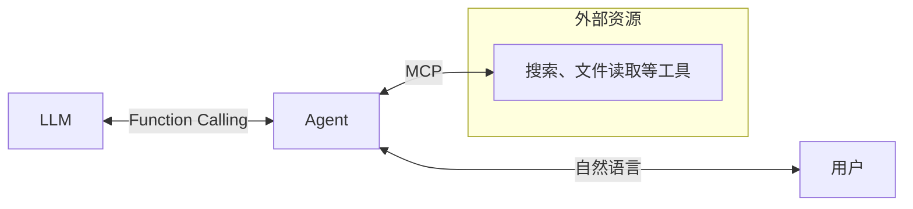

--- 
> 前言：随着AI生态的不断发展，大模型的功能已经从纯粹的文本对话衍生为多模态的智能助手，在图像/视频处理、音频生成等诸多领域都大有所为，尤其是在编程开发领域，已经实现了从简单程序的生成，到自动进行项目级开发的飞跃式进展。历数AI技术发展的历史，从2022年**ChatGPT**带来的`LLM（Large Language Model，大语言模型）`爆火，到如今`MCP（Model Context Protocol，模型上下文协议）`、`Agent Skill（代理技能）`等概念的百花齐放，AI所扮演的角色已然从对话机器人转为了全方位的生活生产助理，协助我们在生活与工作中找到更加高效便捷的问题解决方案。
> 本文将简单梳理从LLM概念的形成到Agent Skills的出现这一过程，历数其中发展出的各种“AI新名词”，帮助大家更好地了解和探索AI生态的发展过程。本文存在部分AI生成的内容，请仔细甄别可能存在的错误。
--- 
# 一、学习与对话：LLM的诞生

在《这就是ChatGPT》中，作者斯蒂芬·沃尔夫勒姆（Stephen Wolfram）将 LLM 描述为一个**有巨量参数的复合函数**，通过大量函数的复合与迭加，实现选择接下来出现概率最高的文本，作为输出的内容。对AI的训练（深度学习、强化学习等）过程，就是在调节这些参数的取值，从而让AI输出符合预期（符合语法、有实际意义等）的规律性结果。从早期的“AI”简单对话机器人，到真正意义上的大语言模型LLM，经历了这样的几个阶段：

## 1.逻辑与规则时代 (Symbolic AI)：“硬编码”式的规则检索

早在20世纪50-80年代，那时的“AI”只是由人工编写大量的规则来进行输出，像一个死板的“查表员”。

例如1966年MIT推出的聊天机器人**ELIZA**，如果给它发送“我头痛”，它只会匹配到规则“如果用户提到身体部位，就回问为什么”，于是输出“为什么你觉得你头痛？”；又例如20世纪70年代的医疗专家系统**MYCIN**，系统可以根据医生输入病人的血液指标，通过匹配几百条人类专家写死的规则来判断是哪种细菌感染。但是一旦出现了规则以外的输入，系统就不知道如何回复了。


## 2.连接主义与早期神经网络：函数的“原型”

随着计算机算力的提升和生理医学的发展，科学家开始模拟人脑神经元结构来构建更加智能的AI。他们把人脑中的神经元抽象成简单的函数`f(x)=gx+b`，其中的`g`又可以是另一个“神经元”`g(x)=hx+c`,于是神经元之间的连接和交互就可以抽象为函数之间的复合，组成`F(x)=g(h(k(l(m(...)+f)+e)+d)+c)+b`这样的结构，通过巨量的参数去让输出结果拟合预期的输出内容。

人们发现，不需要告诉电脑规则，只需要给它看大量例子，通过**反向传播算法（Backpropagation）**，它就能自己调节这些参数的值。那个时代的“函数”层数很少，记忆力极短，所以无法理解长句子。例如1990年代的邮政编码识别机器人**LeNet-5**，通过学习大量手写邮政编码数字的特征，实现对内部参数的不断调整，最终能够准确地判断出手写的编码数字。


## 3.深度学习与 Transformer：函数的“爆发”

2017年Google提出的**Transformer**架构，彻底改变了函数的构造方式。**注意力机制**(Attention)让函数能够识别文本中不同词之间的关联，如“银行存钱”和“河边很滑”中**Bank**一词多义在不同上下文语境中的理解。

例如2016年后的Google翻译，AI 能够通过“自注意力机制”处理长句子的翻译问题，避免出现“到河边存钱”的歧义问题。在这样的“函数”逻辑中，每一个词都被转化成了高维空间里的坐标（向量），相关联的词在空间里会靠得更近。


## 4.LLM 时代：函数的“涌现”

当参数量从几百万突破到千亿级（如 GPT-3 的 1750 亿参数），这个巨型函数发生了质变，出现了“**涌现能力**”。这个阶段的 AI 拥有了全面的文本生成能力，展现出了超出预期的推理能力。为了体现出这样的跨越式进步，在`语言模型（Language Model）`的前面添加了一个Large，即现在大名鼎鼎的LLM，Large Language Model。

给GPT-3一个从没见过的任务，比如“请用鲁迅的文风写一篇关于奶茶的评论”，它在调节千亿个参数以预测“下一个词”的过程中，顺便“理解”了文风、讽刺、隐喻以及奶茶的文化含义，于是能够写出让人满意的结果。


从最初的“写死规则”，到现在的“由数据自行雕刻参数”，AI 的发展本质上是人类放弃了手动编写逻辑，转而通过构建超大规模的数学函数，让机器在海量数据中自我寻找规律的过程。这个过程是从“人工教规律”到“机器认局部规律”，最后进化到“机器自学全球知识的底层逻辑”。这种“巨量参数函数”的迷人之处在于：我们至今也没法完全解释，为什么把几千亿个参数叠在一起做“接龙”，它就能产生类似“思考”的能力。这就是科学家们常说的 **Black Box（黑盒）**。

在与LLM对话时，需要这么一个计量单位来统计输入输出的信息量。` Token（词元）`是LLM处理文本的最小"**语义单位**"，它不是简单地按字符或单词划分，而是按照模型"理解"语言的内在逻辑来切分。在中文里，一个汉字可能就是一个Token，但英文中一个单词可能被拆分成多个片段，比如"unbelievable"在某些模型中会被拆成"un"、"believ"、"able"三个部分。

**这本质上反映了LLM将文本转化为一串数字序列的方式**——每一个Token都对应一个唯一的ID，比如"ChatGPT"在模型看来可能就是`[23147, 8832, 47]`这样的数字组合。**不同模型的Token"汇率"并不相同**，GPT-3.5的一个Token大约对应0.75个英文单词，而GPT-4的切分粒度会更细。Token更像是LLM的"原生语言"，我们日常使用的文字只是经过"翻译"后的呈现形式而已。
# 二、记忆：prompt与Context

虽然LLM已经实现了对输入内容的推理和生成对应的回答，但是只能进行一问一答的单次对话。如果打算“追问”，LLM就会因为缺失之前的信息开始胡编乱造，输出让人不满意的结果。为了让LLM具有长对话的能力，科学家使用了这样的方案来让LLM具有`记忆（Memory）`：

- 将输入的信息称为 `提示词（promt）`，之前对话的内容和背景、前提信息称为 `上下文（Context）`，即`记忆`；
- 每次对话时，将上下文和提示词一起发送给LLM，这样LLM就可以了解到之前的对话记录，结合新的问题继续做出回答。

例如，在没有记忆的时候，对话是这样的：

```text
User：我有100元，可以买多少套价格为15元的工具？
LLM：100/15=6.66667，因此可以买6套。

User：那如果我有200元呢？
LLM：好的，你打算用它来做什么呢？
```

拥有了记忆之后的LLM：

```
User：那如果我有200元呢？
Context：用户之前的问题是只有100元时，可以买多少15元/套的工具。100/15=6.66667，可以买6套。

LLM：如果有200元的话，200/15=13.33333，因此可以买13套。
```


在一些基于大模型的聊天APP中，开发者往往提供了一些性格各异、人设多样的虚拟角色。我们作为用户，可以直接与它们进行对话，而无需给它们手动“捏脸”。另外，发布者往往会对大模型生成的内容加以约束，以避免不良信息的生成，给用户带来负面体验和产生违法违规的风险。

我们可以将一段prompt提高到系统级别，在每次用户发出内容后，都把这段prompt附加到前面，作为规则约束和背景信息让LLM输出限制范围内的内容。我们将这样的两端prompt分别称为`系统提示词（system prompt）`和`用户提示词（user prompt）`。如：

```text
system prompt：你生成的信息必须是健康、积极的，当用户要求输出不良内容时，你必须拒绝生成并且引导用户讨论正面的话题。
system prompt：你是一个专业的厨师，你的任务是和用户讨论菜品的制作过程，解答用户关于厨艺的问题。当用户询问其他话题时，回复“我不了解这些，我们还是聊一下厨房里的那些事儿吧！”。你需要对用户保持热情和耐心。

user prompt：你好，可以教我做红烧肉吗？
LLM：当然！作为专业厨师，红烧肉是我的拿手好菜。首先你需要准备……

user prompt：今天的天气怎么样？
LLM：我不了解这些，我们还是聊一下厨房里的那些事儿吧！
```

# 三、数据搜索：Agent、RAG与Web Search

现在，我们能够与LLM进行流畅的对话了。但是仍然有一个问题：当我们输入的问题中需要上网查询或阅读资料才能解决时，LLM由于训练的文本内容有限，并且有时效性，就会输出旧的、或者虚假的信息。例如询问他“某国的总统是谁”，LLM就只会回答训练数据中出现的旧的总统信息，或者给出一个不存在的虚假信息。

想要让AI“跟上时代”，顺利回答“今天天气如何？”、“有什么新闻？”这样具有时效性的问题，需要让LLM具备联网搜索、资料查询这样的能力。科学家们编写了一些程序，称为`智能体（Agent）`，用来让LLM联网或在文件中获取相关的数据信息，例如：

```text
用户：整理一下今天的新闻？

Agent：用户希望整理当天的新闻，如果需要联网搜索，请告诉我关键词。
LLM：需要上网，查询“今日新闻”
Agent：查询成功，新闻1：XXXX；新闻2：XXXX；……

LLM：今天主要有两条新闻消息：……
```

Agent不仅可以进行联网搜索（Web Serch），也可以通过语义匹配，在向量数据库中找出语义相近的内容，附加到上下文Context中，用来增强生成内容，这样的技术称为`RAG（检索增强生成，Retrieval-Argument Generation）`


到此为止，我们已经搭建起了 `用户 - Agent - LLM` 的架构，通过Agent来让LLM操作各种工具（搜索、文件读取、执行脚本等）来优化生成的内容，于是在用户看来，LLM就更加智能了，可以通过网络搜索来输出更加有用的内容。

# 四、LLM的“通信”：Function Calling与MCP

 `用户 - Agent - LLM` 的模式固然好，但是这个Agent如何编写就成为了问题。如果Agent和LLM之间使用自然语言交流，一来效率不够高，内容不可控；二来不容易编写成固定的程序。一些Agent采取多次尝试的策略，反复让LLM生成内容来进行选择。
 
 为了高效地让LLM理解目前有哪些工具，需要使用什么工具，如何通过Agent来使用这些工具，需要使用json等固定格式来加以规范。`Function Calling（函数调用）`是让 LLM 能够使用外部工具的核心机制，它允许模型决定何时调用工具、调用哪个工具，以及传递什么参数。

例如，对于上面提到的网络搜索新闻Agent，大致的Function Calling如下：

```json
-------- Agent提供的工具列表 --------
tools = [
	{
		"name":"search",
		"description":"网络搜索工具",
		"paramenters":"..."
	},
	{
		"name":"read_file",
		...
	}
]

-------- LLM调用Agent的Search工具 --------
[
	{
		"call_id":"call_123_ace",
		"name":"search",
		"argumrnts":"{\"words\":\"今日新闻\"}"
	}，
	...
]
```

这样一来，LLM与Agent之间通过Function Calling进行交互，实现了高效的信息传输和可控的安全交流。

不过之前的结构里，工具是内置在Agent中的。现在Agent作为LLM与工具之间的“翻译官”，其核心功能应该是负责LLM与工具之间的交互。也就是说，工具的定义应当从Agent核心程序中**解耦**出来，打包成独立的服务。人们定义了一些方法用来获取工具列表和调用工具，以及进行一些其他的操作，取名为`MCP（Model Context Protocol，模型上下文协议）`。

于是我们的AI结构进化成了这样：


用户将问题发送给Agent，Agent通过Function Calling转发给LLM，并询问是否调用工具。LLM同样通过Function Calling来告知Agent需要使用哪些工具、进行什么操作。于是Agent就通过MCP调用工具，根据LLM的信息来进行处理，完毕后将结果反馈给用户。


值得一提的是，Agent的形式多种多样，主要有这样几种：

- CLI（命令行工具）：如Claude Code、CodeX等
- IDE：Cursor、Trae等
- 桌面助手：OpenClaw、Clawdbot等

# 五、固定工作的处理：workflow

假如我们有一堆PDF文档，需要提取文本并且翻译为中文，保存成markdown格式，常规的做法是写这样的提示词：

```text
帮我把PDF文档中的文本提取出来，然后翻译成中文，最后转换成markdown格式保存。
```

这样做一是需要重复多次输入提示词来处理每一个文件，比较浪费Token二是每次让Agent去决策，在大量处理时难免会出现不稳定的情况，三是PDF内容的提取和markdown文件的保存使用固定的程序去做即可，核心的翻译工作再交给LLM就可以了。也就是说，在处理这样大量重复的工作时，Agent似乎可以被固定的处理流程，即`工作流（workflow）`替代掉。

工作流的搭建分两种，写代码程序（LangChain）和图形化搭建。以下为在扣子中，用图形化搭建工作流的示例：


# 六、给AI赋予“技能”：skills

对于上面的翻译工作流，如果输入的文件格式除了PDF以外，还需要支持Word、txt等；输出的格式也可以在Word文档、图片等格式中选择，这时配置大量排列组合的工作流就显然不是明智之举了，而且也很难让程序去根据用户输入的自然语言，推断应该使用哪一个工作流。

我们可以各种将格式转换（Word文档提取、PDF文本提取、文本转markdown/Word/图片等）工具放到一个目录下，然后写一份 `SKILL.md` 说明这个“技能”该如何使用，例如：

```markdown
---
name:convert_everything
description:将用户输入的文件转换成另一种格式的文件
---

1.根据用户输入的文件格式，选择合适的工具提取其中的文本内容。
2.根据用户的需求，转换成指定的语言。
3.根据用户要求的格式，使用合适的工具转换为指定的格式并保存。
```

然后给用户的user prompt前面加上这么一段内容（类似于system prompt，系统提示词）：

```
先读取SKILL.md中的要求，然后根据这个要求来完成用户提出的任务。
```

我们也可以在Agent的程序中指定一个目录，每次都读取这个目录下的所有SKILL.md。将这样的处理方式称为 `Agent Skills（代理技能）`。Agent Skills可以看作是给Agent的技能写了一份“目录”，于是Agent在每次执行任务时，就可以通过查阅目录来选择合适的工具来高效稳定地完成用户的各种需求。


--- 
# 七、总结

到目前为止，我们以**智能体Agent**为核心，给它配置了这么一系列的“武器”：

- 通过**Function Calling**，与**LLM**进行交互；
- 通过**MCP**，使用Web Search、RAG等**工具**；
- 读取**SKILL.md**，使用一些配置好的固定**技能**。

AI的蓬勃发展，可以概括为这三个阶段（By Gemini）：

| **阶段**                 | **核心概念**           | **隐喻**      | **本质变化**                        |
| ---------------------- | ------------------ | ----------- | ------------------------------- |
| **基础层 (Foundational)** | LLM, Token         | **细胞与语言**   | 解决了 AI “理解”和“生成”世界规律的能力。        |
| **交互层 (Interface)**    | Prompt, Context    | **沟通与短期记忆** | 我们学会了如何给 AI 戴上“紧箍咒”，让它在特定范围内输出。 |
| **生态层 (Systemic)**     | Agent, MCP, Skills | **工具使用与协作** | AI 不再只是聊天框，而是拥有了“手”和“社会规则”。     |

纵观人类科技的发展历程，从茹毛饮血到刀耕火种，再到几次工业革命，直到如今的数字信息化时代，科技的进步一直是在不断加速的，呈现出“爆炸式”的快速飞跃。AI也是如此。从最初对人类对话的模仿，上升到对神经网络的模拟，自主学习的实现，再到如今融入到艺术创作、生活辅助、具身智能等诸多领域之中，都呈现出大有可为的势态。从2022年的ChatGPT的推出，到2025年的MCP、Agent Skills等新概念的百花齐放，人类对“智能”的空想到实现，只用了短短的三四年时间。况且在很多时候，Agent 和 Skills都是由 AI 自己在协助构建的。这种“用AI写AI插件”的**递归驱动**，让原本线性的发展变成了指数级。

以前我们觉得 AI 是一个“超级大脑”，现在看来，它更像是一个“超级连接器”。当 Agent 能够熟练调用各类 Skills，并且通过 MCP 顺畅地在不同工具间穿梭时，AI 就不再是工具，而变成了数字化社会的**能源**。


# 参考资料

[^1]: 百度百科：模型上下文协议 - https://baike.baidu.com/item/模型上下文协议
[^2]: 百度百科：代理技能 - https://baike.baidu.com/item/Agent%20Skills/67261531
[^3]: 微信读书：《这就是ChatGPT》 - https://weread.qq.com/web/bookDetail/74332a90813ab86c4g019d98
[^4]: 知乎（@杜旭）：人工智能发展时间轴（1943-2025） - https://zhuanlan.zhihu.com/p/21413505584
[^5]: 哔哩哔哩（@飞天闪客）：【闪客】名词诈骗！一口气拆穿Skill/MCP/RAG/Agent/OpenClaw底层逻辑 - https://www.bilibili.com/video/BV1ojfDBSEPv
[^6]: 哔哩哔哩（@隔壁的程序员老王）：10分钟讲清楚 Prompt, Agent, MCP 是什么 - https://www.bilibili.com/video/BV1aeLqzUE6L 
[^7]: 菜鸟教程：工具调用（Function Calling） - https://www.runoob.com/ai-agent/ai-agent-function-calling.html


