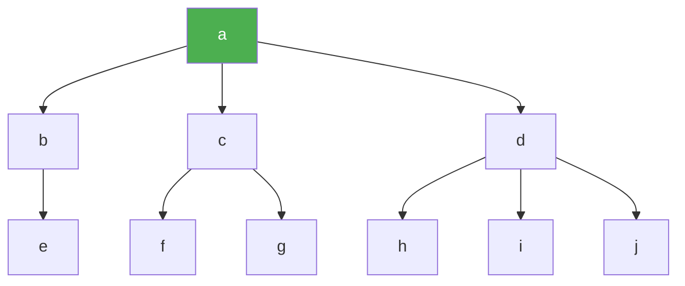

---

---
--- 
> 声明：本篇笔记摘自[《数据结构教程》 - 清华大学出版社](http://baike.baidu.com/item/%E6%95%B0%E6%8D%AE%E7%BB%93%E6%9E%84%E6%95%99%E7%A8%8B%EF%BC%88%E7%AC%AC5%E7%89%88%EF%BC%89/22216268?fromModule=search-result_lemma)，遵循[CC BY 4.0协议](https://creativecommons.org/licenses/by/4.0/legalcode.zh-hans)。
> 存在由AI生成的小部分内容，仅供参考，请仔细甄别可能存在的错误。
--- 
# 一、数据结构定义

## 1.数据与数据结构

- **数据**：是描述客观事物的数和字符的集合。通常以**数据元素**作为数据的基本单位。
	- **数据项**：是具有独立含义的数据最小单位，也称为**字段**或**域**。
	- **数据对象**：是指性质相同的数据元素的集合，它是数据的一个子集。
- **数据结构**：是指所有数据元素以及数据元素之间的关系，可以看作相互之间存在某种特定关系的数据元素的集合。

- **数据结构 = 数据 + 结构**。数据结构通常包含以下几项：
	- 逻辑结构：数据元素之间逻辑上的结构
	- 存储结构：数据元素在计算机上的实际存储结构

## 2.逻辑结构

逻辑结构可以看作是从具体问题抽象出来的数据模型，与实际的存储结构无关。
### ① 逻辑结构的表示

常用的逻辑结构表示方式有**图表**和**二元组**。
#### a.图表

使用类似于数据库的结构记录和描述数据的逻辑关系：

| 学号        | 姓名   | 性别  | 班号   |
| --------- | ---- | --- | ---- |
| 240704874 | 张三   | 男   | 9901 |
| 240704875 | 李四   | 女   | 9901 |
| 240704876 | 王二麻子 | 男   | 9902 |

#### b.二元组

表示格式为 `B=(D,R)`，其中D是数据元素的集合，R是D上的二元关系。

R中的关系r是序偶的集合，对于r中的序偶<x,y>∈r表示x与y相邻，x在y前面，称为y的直接**前驱元素**。y是x的直接**后继元素**。

没有前驱元素的元素称为**开始元素**；没有后继元素的元素称为**终端元素**。

若x,y是对称的，可以记为**(x,y)∈r**，对应图中的无箭头连线。

### ② 逻辑结构的类型

- **集合（set）**：数据元素同属于一个集合，别无其它关系。
- **线性结构（linear structure）**：数据元素之间存在一对一的关系。
- **树形结构**：数据元素之间存在一对多的关系。
- **图形结构**：数据元素之间存在多对多的关系。

--- 
示例：对于数据结构 $B_{1} = (D, R)$，其中有：
```C
D = {a,b,c,d,e,f,g,h,i,j}                     // 有这么多数据
R = {r}                                       // 有这些关系组
r = {<a,b>, <a,c>, <a,d>, <b,e>, <c,f>, <c,g>, <d,h>, <d,i>, <d,j>}   // 关系组r中有这些关系
```

对应的图形表示如下：



可以看出这个数据结构是一种树形结构（也算图的一种）。

--- 

## 3.存储结构

即数据在计算机中实际的存储实现。通常需要既存储每个数据元素，又要存储它们之间的逻辑关系。

### ① 顺序存储结构

- 采用一组连续的存储单元存放所有的数据元素，所有的元素占据一整块存储空间。
- 顺序存储的各元素的地址是连续的，即逻辑相邻的数据在存储上也是相邻的。

优点：
- 存取方便，可以随机（按照索引）存取。
缺点：
- 元素的插入/删除需要挪动大量元素的位置，改动较大。

--- 
使用顺序存储结构存储的示例如下：

``` Cpp
struct {
	int number;
	char name[4];
} Student[7] = {{1,"张三"}, ..., {7,"李四"}}；
```

--- 
### ② 链式存储结构

每个元素用一个内存结点存储，每个结点独立分配，不一定存储在一起。
给每个结点添加**指针域**，用于存放相邻结点的存储地址。

优点：
- 便于数据修改，删除/添加元素时修改指针域即可。
缺点：
- 需要使用额外的存储空间来存放指针，内存使用率低于顺序存储。

--- 
使用链式存储结构存储的示例如下：

```cpp
struct {
	int number;
	char name[4];
	struct Stu_node * next;     // 指向下一个学生结点的指针
} Student[7] = {{1,"张三"}, ..., {7,"李四"}}；
```

--- 
### ③ 索引存储结构

在存储数据元素信息的同时建立附加的索引表，将数据元素和存储地址建立联系。
索引项的一般形式为“关键字，地址”。通常索引表中的索引项按关键字排序。

索引存储的查找效率比较高，但是索引表的存储增加了空间的开销。

### ④ 哈希（散列）存储结构

根据元素的关键字，通过哈希函数直接计算得出一个值，作为元素的存储地址。

优点是查找效率高，适合用在需要快速查找和插入的场景。

## 4.数据运算

数据运算指对数据实施的操作。最常用的操作有**查找、插入、删除、更新和排序**等。

对于一种数据结构，其逻辑结构是唯一的，但可能对应了多种存储结构，并且在多种结构中，进行同一种操作的实现过程页也往往不同。

## 5.数据类型和抽象数据类型

### ① 数据类型

数据类型是一组性质相同的值的集合以及定义在此集合上的一组操作，是编程语言中已经实现的数据结构。

### ② 抽象数据类型（ADT）

指用户进行软件系统设计时，从问题的数据模型中抽象出来的逻辑数据结构和数据结构上的运算，而不考虑计算机具体的存储逻辑和运算实现的算法。

一个抽象数据结构可以使用（D，R，P）三元组表示，分别为数据、关系、运算：

```DAT
ADT 抽象数据类型名称 {
	数据对象：对象声明
	数据关系：关系声明
	基本运算：运算名称(参数表)：功能描述
}
```

其中基本运算的参数表中有两种参数格式：
- 值参数：只提供输入值
- 引用参数：可能提供输入值，返回运算结果

--- 
示例：一个复数的ADT如下所示：

```ADT
ADT Complex {
	数据对象：
		D = {e1, e2 | e1,e2均为实数}
	数据关系：
		R = {<e1, e2> | e1,e2分别为复数的实部和虚部}
	基本运算：
		AssignComplex(&z, v1, v2)：构造复数z，实部和虚部分别为v1和v2
		Add(z1, z2, &sum)：将z1,z2两个复数相加，结果返回到sum中
}
```

--- 

抽象数据结构的两个重要特征：
- **数据抽象**：用ADT描述程序处理的数据的特征、完成的功能和外部用户的结构（类似于API文档）。
- **数据封装**：将程序的外部特征和内部实现分离，对外部的用户隐藏内部的实现细节。

# 二、算法及其描述

## 1，算法的定义

**算法**是对特定问题求解步骤的一种描述，是指令的有限序列。一个算法应当满足以下五个重要特性：

1. **有穷性**：一个算法必须总是在执行有限步之后结束
2. **确定性**：对每种情况的操作都必须有明确规定，对相同的输入只能有唯一的输出，不能有二义性
3. **可行性**
4. **有输入**
5. **有输出**

算法不一定是程序，但程序中一定包含了一个或多个算法。算法必须是有穷的，而程序可以无穷地运行下去。

## 2.算法设计的目标

算法设计应当满足以下的几个目标：

1. **正确性**
2. **可使用性**
3. **可读性**：算法的逻辑应当清晰简单、结构化，易于使人理解
4. **健壮性**：要求具有良好的容错性，能够进行异常处理
5. **高效率与低存储量需求**：通常在运行时间尽量短的前提下，减少算法的空间开支

## 3.算法分析

评估一个算法的优劣，主要看算法占用计算机资源（CPU时间、内存）的多少。
算法分析的目的是分析算法的时空性能以改进算法。

### ① 时间复杂度分析

一般使用**大O表示法**来衡量算法的时间复杂度，使用O(f(n))的形式来表现运行时间随输入规模变化的**变化趋势**。其估计方法如下所示：
（这里偷个小懒，把O($log_2{n}$)直接写成O(log2n)，需要注意区分。）

#### a.单层循环分析步骤

1. 列举t=0,1,2,3,…,n，求出对应i的值
2. 找到i关于t的表达式
3. 确定循环停止的条件
4. 联立步骤 2、3，求解出t的值，去掉常数项,保留最高项后，即为大O表示法的时间复杂度

--- 
 **例 1**
```cpp
i = n * n;
while (i != 1) {
	i = i / 2;
}
```
分析：
- t=0,1,2,3,…,n时，i=$n^2$,$\frac{n^2}{2}$​,$\frac{n^2}{4}$​,$\frac{n^2}{8}$​,…
- i=$\frac{n^2}{t^n}$​，取i=1得$n^2$=$2^t$
- t=$log_2n^2$=2log2n
- 时间复杂度：O(log2n)

 **例 2**
```CPP
int i = 1;
while (i <= n) {
	i = i * 2;
}
```
分析：
- t=0,1,2,3,…时，i=1,2,4,8…
- i=2t，取i=n得n=$2^t$
- t=log2​n
- 时间复杂度：O(log2​n)

**例 3**
```cpp
int i = 0;
while (i * i * i <= n) {
	i++;
}
```
分析：
- t=0,1,2,3时，i=0,1,2,3
- i=t，取$i^3$=n得t=$\sqrt[3]{n}$​
- 时间复杂度：O($\sqrt[3]{n}$)
 
--- 

#### b.多层循环分析步骤

1. **各层独立**：直接将各层时间复杂度相乘

--- 
```cpp
int cnt = 0;
for (int k = 1; k <= n; k *= 2) {
	for (int j = 1; j <= n; j++) {
		cnt++;
	}
}
```
分析：
- 外层循环：t取1、2、3、4时，k取1、2、4、8，即k = $2^t$，k=n结束时，$n=2^t$，t=log2​n，时间复杂度O(log2​n)
- 内层循环：时间复杂度O(n)
- 整体时间复杂度：O(nlog2​n)
--- 

2. **各层不独立**（使用相同计数变量等）：计算内层在每次外层循环的执行次数，求和后取最高项
--- 
```cpp
for (int i = 0; i < n; i++) {
	for (int j = i; j < n; j++) {
		// 冒泡排序逻辑
	}
}
```

分析：

- 外层t从0到n−1时，内层执行次数依次为n,n−1,n−2,…,1
- 总执行次数：1+2+⋯+(n−1)+n = n(n+1)/2​
- 保留最高项并去除常数项，时间复杂度：O($n^2$)
--- 
#### c.常见时间复杂度

| 复杂度        | 名称    | 效率  | 场景           |
| ---------- | ----- | --- | ------------ |
| O(1)       | 常数阶   | 极快  | 访问数组下标、哈希表查找 |
| O(log2​n)  | 对数阶   | 很快  | 二分查找、平衡二叉树操作 |
| O(n)       | 线性阶   | 一般  | 遍历数组、链表查找    |
| O(nlog2​n) | 线性对数阶 | 较好  | 快速排序、归并排序    |
| O(n2)      | 平方阶   | 较慢  | 冒泡排序、嵌套循环    |
| O(2n)      | 指数阶   | 极慢  | 递归求斐波那契数列    |
#### d.算法的最好、最坏和平均时间复杂度

设一个算法的输入规模是n，Dn是所有输入的集合，P(I)是输入集合中I的出现频率，T(I)是算法在输入I下执行的基本操作次数，则平均时间复杂度定义为：
$$
E(n)=\sum\limits_{I\in Dn}{P(I)\times T(I)}
$$最好时间复杂度：算法在最好情况下的时间复杂度，即：
$$
B(n)=\underset{I\in Dn}{MIN}\{T(n)\}
$$
最坏时间复杂度：算法在最坏情况下的时间复杂度，即：
$$
W(n)=\underset{I\in Dn}{MAX}\{T(n)\}
$$

对于这两种情况下的时间复杂度分析，通常是寻找该算法的极端实例下的时间复杂度，而非按照定义式去计算和取最值。

--- 
例:
```cpp
int fun(int a[], int n, int i) {
	int j;
	for (j = ; j < i-1; i++) {
		cout << a[j] << endl;
	}
}
```
上述算法的平均时间复杂度为O(n)，
- 最好情况下数组中只有一个元素，时间复杂度为O(1)；
- 最坏情况下数组中有n个元素，时间复杂度为O(n)

--- 

### ② 算法的空间复杂度分析

一个算法的存储量通常包括：
- 输入输出数据占用的空间
- 程序本身占据的空间
- 临时变量占据的空间

对算法空间复杂度分析时，通常只考虑临时变量的空间使用情况。

空间复杂度的表示也采用大O表示法，其估计方法与时间复杂度想似。

--- 
实例：
```cpp
int fun(int a[], int n, int i) {
	int j;
	for (j = ; j < i-1; i++) {
		cout << a[j] << endl;
	}
}
```

函数内部仅声明了一个局部变量j，其占用空间为常数级（通常 4~8 字节），与输入规模n或i无关。
因此该算法的空间复杂度为O(1)。

--- 

时间复杂度是常数的算法也称为**原地(就地)工作**算法