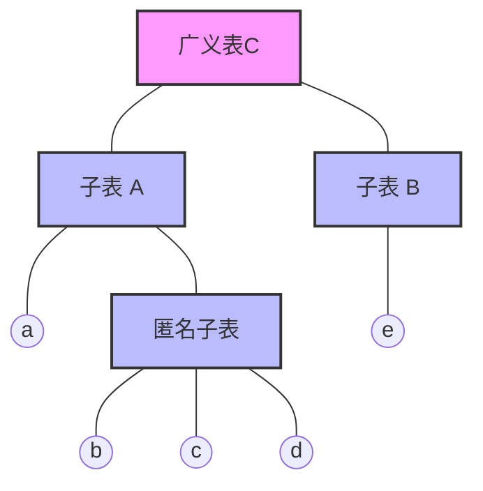

---

---
--- 
> 声明：本篇笔记摘自[《数据结构教程》 - 清华大学出版社](http://baike.baidu.com/item/%E6%95%B0%E6%8D%AE%E7%BB%93%E6%9E%84%E6%95%99%E7%A8%8B%EF%BC%88%E7%AC%AC5%E7%89%88%EF%BC%89/22216268?fromModule=search-result_lemma)，遵循[CC BY 4.0协议](https://creativecommons.org/licenses/by/4.0/legalcode.zh-hans)。
> 存在由AI生成的小部分内容，仅供参考，请仔细甄别可能存在的错误。
--- 

# 一、数组

## 1.基本概念

**一维数组A**是n（n>1）个相同类型的数据元素构成的有限序列：

$$
A=(a_1,a_2,...,a_n)
$$

二维数组可以看成每个数据元素都是一个一维数组的数组：

```text
a = ((a1, a2, ..., an),
	 (b1, b2, ..., bn),
	 (c1, c2, ..., cn),
	 ... ,
	 (x1, x2, ..., xn),
	)
```

对于d维数组，ADT定义中的基本运算包含以下几种：

- `InitArray(&A)`：初始化数组，分配存储空间
- `DestoryArray(&A)`：销毁数组，释放存储空间
- `Value(A, index1, index2, ..., indexd)`：返回d维数组中的值 `A[index1][index2]...[indexd]` 
- `Assign(A, e, index1, index2, indexd)`： 将 `A[index1][index2]...[indexd]` 的值赋给e

注意这里的**数组**和C语言的“数组”、Python中的“列表”不同，这里指的是一种数据结构而不是数据类型，前者通常由后者来具体实现。很多高级语言中的“数组类型”都基本覆盖了上述的操作，可以直接使用这样的数据类型作为数组。
## 2.存储结构

数组这样连续的结构，很适合使用顺序存储实现。通常将一个数组存储在一串连续的内存空间中。逻辑上相邻的数据元素，实际存储的位置也相邻。
### ① 一维数组的存储

如果每个数据元素占用k个存储单元，那么数组元素$a_i$的位置$Loc(a_i)$可以这样求出：

$$
Loc(a_i) = Loc(a_1) + (i-1)\times k \ \ \ \ \ \ \ \ \ (2\le i \le n)
$$
### ② 二维数组的存储

对于m行n列的一个二维数组$A_{m \times n}$，表示如下：

$$
A_{m \times n} = \begin{bmatrix}
  a_{1,1}&a_{1,2}&\ldots&a_{1,n} \\
  a_{2,1}&a_{2,2}&\ldots&a_{2,n} \\
  \ldots&\ldots&\ddots&\ldots&  \\
  a_{m,1}&a_{m,2}&\ldots&a_{m,n} \\
\end{bmatrix}
$$
简记为：

$$
A = (A_1,A_2,\dots,A_i,\dots,A_m)
$$

对于二维数组，存储方式主要有**按行优先存储**和**按列优先存储**这两种。

**行优先存储（Row-major Order）**

- 按行顺序存储，先存完一行所有元素，再存下一行    
- 公式：`LOC(i,j) = LOC(0,0) + (i × n + j) × L`
- 代表语言：C、C++、Java、Python

**列优先存储（Column-major Order）**

- 按列顺序存储，先存完一列所有元素，再存下一列
- 公式：`LOC(i,j) = LOC(0,0) + (j × m + i) × L`
- 代表语言：Fortran、MATLAB
## 二、稀疏矩阵

当一个很大的矩阵中，非零元素个数很少（如100 × 100的矩阵中只有100个非零元素），称这个矩阵是**稀疏矩阵**。
## 1.三元组表示

稀疏矩阵中存在大量的零值，使用传统的二维数组存储会导致大量空间的浪费，需要使用特定的存储方式进行优化。

对于稀疏矩阵中的元素，分别记录它们的所在行数、列数和元素值，得到一个 **三元组(r,c,d)** 即为稀疏矩阵元素的三元组表示。

把稀疏矩阵的三元组线性表按照顺序存储结构存储，称为**稀疏矩阵的三元组顺序表**，简称为**三元组表**。其数据类型声明如下：

```cpp
#define M <稀疏矩阵行数>
#define N <稀疏矩阵列数>
#define MaxSize <稀疏矩阵中非零元素的最多数量>

typedef <矩阵中的数据元素类型> ElemType;

typedef struct {
	int r;                      // 行号
	int c;                      // 列号
	ElemType d;                 // 数据域
}TupNode;                       // 定义三元组类型

typdef struct {
	int rows;                   // 矩阵的行数
	int cols;                   // 矩阵的列数
	int nums;                   // 非零元素个数
} TupNode data[MaxSize];        // 定义三元组顺序表类型

```

使用三元组表示稀疏矩阵后，节省了存储空间，但同时也失去了随机存取的特性，即无法直接通过行号和列号获取/存储元素了。
## 2.十字链表表示

对于稀疏矩阵中的元素，也可以采用链式存储结构，即**十字链表**来进行储存。

十字链表的构建规则：
1. 对每个非零元素创建一个结点，记录元素的行号和列号，以及元素的值
2. 然后对每一行、每一列构建一个带头结点的循环单链表：
	1. 第i行：构建的单链表记作`hr[i]`
	2. 第j列：构建的单链表记作`hc[j]`
3. 将行数和列数相同的两个链表`hr[k]`和`hc[k]`合并到一起，即这个链表（记为`h[k]`）包含了第k行和第k列的所有非零元素
4. 将所有的h链表连起来，构成一个带头结点的循环单链表，总头结点记为hm，存放稀疏矩阵的行数、列数等信息

--- 
例：对于稀疏矩阵B:
$$
B_{3 \times 4} = \begin{bmatrix}
 1 & 0 & 0 & 2 \\
 0 & 0 & 3 & 0 \\
 0 & 0 & 0 & 4 \\
\end{bmatrix}
$$

十字链表的构建过程如下：

1. 构建行、列链表：
	- 行链表:
	    - `hr[0]`: $1 \to 2$
	    - `hr[1]`: $3$
	    - `hr[2]`: $4$
	- 列链表:
	    - `hc[0]`: $1$
	    - `hc[1]`: (空)
	    - `hc[2]`: $3$
	    - `hc[3]`: $2 \to 4$
2. 合并相同行/列的链表，构建h链表：
	- `h[0]`：$1 \to 2$
	- `h[1]`：$3$
	- `h[2]`：$3 \to 4$
	- `h[3]`：$2 \to 4$

最后构建的十字链表如下图所示：


矩阵中的每个非零元素都在两个链表交叉形成的“十字路口”，十字链表因此得名。

--- 
# 三、广义表

## 1.定义

**广义表**是线性表的推广，是有限个元素的序列，其逻辑结构表示如下：

$$
GL=(a_1,a_2, \dots, a_i, \dots, a_n)
$$

其中n表示广义表的**长度**。

- 如果广义表中的元素 $a_i$ 属于原子类型（整型、字符型等不可分割的数据类型），称为广义表的**原子**。
- 如果 $a_i$ 也是一个广义表（数组、字符串等），称为广义表的**子表**。

- **表头**：广义表的第一个元素$a_1$
- **表尾**：除表头之外，其余的部分 $(a_2, \dots, a_i, \dots, a_n)$
	- 表尾始终是一个广义表，空表无表头、表尾

广义表的重要特征：
- 数据元素是相对**有次序**的
- **长度**定义为最外层元素的个数（子表的长度不计入总表）
- **深度**定义为表中括号的重数，原子的深度为0，子表的深度为1
- 一个广义表可以被其他广义表**共享**，这样的共享广义表称为**再入表**
- 一个广义表可以是自己的子表。这样的广义表称为**递归表**
	- 递归表的深度是无限的，而长度是有限的

广义表的ADT定义如下：
```ADT
ADT Glist
{
    数据对象：
	    D = { e[i] | 1 <= i <= n, n >= 0, e[i] ∈ AtomSet 或 e[i] ∈ GList, AtomSet 为某个数据对象 }
    数据关系：
	    R = { <e[i-1], e[i]> | e[i-1], e[i] ∈ D, 2 <= i <= n }
    基本运算：
	    CreateGL(s): 创建广义表 g, 由括号表示法 s 创建并返回一个广义表
	    DestroyGL(&g): 销毁广义表, 释放广义表 g 的存储空间
	    GLLength(g): 求广义表 g 的长度
	    GLDepth(g): 求广义表 g 的深度
	    DispGL(g): 输出广义表 g
}
```

值得注意的是，这里数据对象的定义 `e[i] ∈ AtomSet 或 e[i] ∈ GList` 就是根据广义表的递归性给出的。

为了简单表示，不讨论递归表和再入表，只看一般的广义表。规定使用小写字母表示原子，大写字母表示广义表名。

--- 
例：有以下几个广义表：

```text
A = (a, (b, c, d))
B = (e)
C = (A, B) = ((a, (b, c, d)), (e))
```

其中广义表C的深度为3，长度为2，结构如下图所示：



--- 

## 2.存储结构

广义表是递归定义的，其中每个元素占据的内存空间不确定，不适合顺序存储。因此，广义表多采取**链式存储**。

对于广义表中的元素，由于有原子和子表这两种，采取如下的结点结构：

```text
+-----+--------------+------+
| tag | sublist/data | link |
+-----+--------------+------+

tag：标识结点，规定tag为0是原子，tag为1是子表
sublist/data：指向子表的指针/原子的数据域
link：指向下一个元素的指针
```

对应的结点类型声明：

``` cpp
typedef struct lnode {
	int tag;
	union {          // 采用联合体保证结点只有其中的一个字段
		ElemType data;
		struct lnode *next;
	} val;
	struct lnode *link;
}
```

--- 
例：对于上例的广义表 `C = ((a, (b, c, d)), (e))` ，其链式存储结构如下图所示：

 

--- 