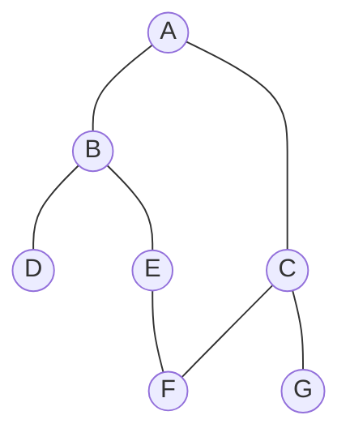

---

---
--- 
> 声明：本篇笔记摘自[《数据结构教程》 - 清华大学出版社](http://baike.baidu.com/item/%E6%95%B0%E6%8D%AE%E7%BB%93%E6%9E%84%E6%95%99%E7%A8%8B%EF%BC%88%E7%AC%AC5%E7%89%88%EF%BC%89/22216268?fromModule=search-result_lemma)，遵循[CC BY 4.0协议](https://creativecommons.org/licenses/by/4.0/legalcode.zh-hans)。
> 存在由AI生成的小部分内容，仅供参考，请仔细甄别可能存在的错误。
--- 
# 一、图的基本概念

## 1.图的定义

- **图**由顶点的有限集合$V(G)$和连接V中两个不同顶点的边的有限集合$E(G)$组成，记作 $G=(V,E)$
- 根据边的有向性，将图分为**有向图**和**无向图**两大类
	- 对于一条边$E(i,j)$，有向图中记为 `<i,j>`，无向图中记为 `(i,j)`

图的ADT定义如下：

```ADT
ADT Graph {
	数据对象：
		D = { a[i] | 1<=i<=n, n>=0, a[i]为ElemType类型}
	数据关系：
		R = {<a[i], a[j]> | a[i], a[j]∈D, 1<=i, j<=n, 其中每个元素可以有零个或多个前驱/后继元素}
	基本运算：
		CreateGraph(&g)：创建图g
		DestoryGraph(&g)：销毁图g，释放内存空间
		DispGraph(g)：输出图g，显示点和边的信息
		DFS(g, v)：从顶点v出发深度优先遍历整个图g
		BFS(g, v)：从顶点v出发广度优先遍历整个图g
		...
}
```
## 2.图的基本术语

1. **端点和邻接点**：对于边 `e = E(i, j)`，称i和j为边的两个端点，它们互为邻接点
	- 称边e与端点i,j**关联**。关联于同样两个端点的多条边称为**多重边**
	- 数据结构中只讨论没有多重边的**简单图**
2. **度数**：无向图中，一个顶点所关联的边的条数称为该点的**度数**
	- 在有向图中，顶点的度分为**入度**（对应终点）和**出度**（对应起点）
	- 在一个图中，**所有顶点的度数之和等于边数的两倍**（顶点的度数之和一定是偶数）
3. **完全图**：无向图中每两个顶点之间都存在一条边的图，有向图中每两个顶点之间都有一对反向边的图
	- 无向完全图中包含$n(n-1)$条边；有向完全图中包含$n(n-1) \times 2$条边
4. **稠密图和稀疏图**：接近完全图的图称为**稠密图**；相反边数很少的图称为**稀疏图**
5. **子图**：若有 $G=(V,E),G'=(V',E')\text{  且  }V'\subseteq V,E' \subseteq E$，称G'是G的**子图**
	- 图的子图也一定是图，因此并非任取V和E的子集都构成子图，需要满足 $G'=(V',E')$
6. **路径和路径长度**：从图的顶点i到顶点j的一条**路径**是一个顶点的序列$(i,i_1,i_2,...,i_m,j)$；**路径长度**是指路径上经过的边的数目
	- 如果路径上所有的点都不相同（没有重复的点），称这是一条**简单通路**
7. **回路或环**：若一条路径的开始点与结束点是同一个点，称这个路径是**回路或环**
	- 如果回路/环上所有的点都不相同（没有重复的点），称这是一个**简单回路/环**
8. **连通、连通图和连通分量**：
	- 若从顶点i到顶点j有路径，称i与j是**连通**的
	- 任意两个点都连通的**无**向图称为**连通图**
	- **无**向图G中的极大连通子图称为图G的**强连通分量**
		- 连通图只有一个连通分量，非连通图可以有多个连通分量
9. **强连通图和强连通分量**
	- 任意两个点都连通的**有**向图称为**强连通图**
	- **有**向图G中的极大连通子图称为图G的**强连通分量**
		- 强连通图只有一个强连通分量，非强连通图可以有多个强连通分量
	- 在非强连通图中查找连通分量的步骤：
		1. 在图中找有向环
		2. 拓展有向环：如果某个顶点有路径到环中的任意一个顶点，并且环顶点也有路径到该点，将这个顶点也加入到强连通分量中
10. **权和网**：
	- 给图中的每条边都附加一个值，称为该条边的**权**，表示两个顶点之间的距离或者花费的代价
	- 边上带有权的图称为**带权图**，也称作**网**
# 二、图的存储结构和基本运算算法

## 1.邻接矩阵存储方法

图的邻接矩阵是一种采用邻接矩阵数组表示顶点之间相邻关系的存储结构。

对于边$v_{i,j}=（e_i,e_j）或 <e_i, e_j>$规定邻接矩阵中的元素$A_{i,j}$ = `A[i][j]` 取如下值：

- 对于无权图，有边则计为1，无边则计为0
- 对于有权图，有边则计这条边的权值，无边则记作无穷$\infty$
- 对角线元素即自己到自己的长度，规定为0
--- 
例：对于这样的一个图，它的邻接矩阵如下所示：

$$
A=\begin{bmatrix}
0 & 1 & 0 & 1 & 0 \\
0 & 0 & 1 & 1 & 0 \\
0 & 0 & 0 & 1 & 1 \\
0 & 0 & 0 & 0 & 0 \\
1 & 0 & 0 & 1 & 0 
\end{bmatrix}

$$

--- 

图的完整邻接矩阵类型定义如下：
```cpp
#define MAXV <最大顶点个数>
#define INF 32767             // 定义∞为一个很大的数

typedef struct {
	int no;                   // 顶点的编号
	InfoType info;            // 顶点的其他信息
} VertexType;                 // 顶点的类型

typedef struct {
	int edges[MAXV][MAXV];     // 定义邻接矩阵数组
	int n,e;                   // 顶点数、边数
	VertexType vexs[MAXV][MAXV];
} MatGraph;
```

使用邻接矩阵存储图使用的存储空间是固定的，适合存储比较稠密的图。
## 2.邻接表存储方法

图的邻接表是一种顺序存储与链式存储相结合的存储方式。

邻接表的创建步骤：
- 对于每个顶点创建一个单链表
- 将每个顶点的关联边作为边结点，链接到对应顶点的链表中
- 将这些单链表的头结点，把顶点的序号作为下标存储在一个数组中

邻接表的数据类型声明如下：
```cpp
typedef struct ANode{
	int adjvex;                // 该边的邻接点编号
	struct ANode * nextarc;    // 指向下一条边
	int weight;                // 该边的权值
} ArcNode;                     // 定义边结点类型

typedef struct Vnode {
	InfoType data;             // 顶点的其他信息
	ArcNode *firstarc;         // 指向第一个结点
} VNode;                       // 定义邻接表头结点类型

typedef struct {
	VNode adjlist[MAXV];        // 邻接表的头结点数组
	int n,e;                    // 图中的顶点数n和边数e
} AdjGraph;                     // 定义邻接表类型
```

---
例：对于上面的图，邻接表结构如下图所示：


---
邻接表是不唯一的，这是因为每个顶点链表中，只表示头结点有到后面的结点的边，链表结点的顺序可以是任意的


邻接表中的每个链表都只存放了以一个顶点为起点的边，因此不容易找到指向该顶点的边，可以设计有向图的**逆邻接表**，其中每个顶点链接的是指向该顶点的边。

--- 
例：上图的逆邻接表如下：


--- 
## 3.图的基本运算算法设计

介绍创建图、输出图和销毁图的基本运算算法设计。对于邻接矩阵实现相关算法是十分容易的，下面讨论邻接表的相关算法设计。

### ① 创建图

```cpp
void CreateAdj (AdjGraph  &G, int A [MAXV] [MAXV], int n, int e) //创建图的邻接表
{
    int i, j; ArcNode * p;
    G=(AdjGraph *)malloc(sizeof(AdjGraph));
    for (i=0;i<n;i++)                   //所有头结点指针域置为空
        G->adjlist[i].firstarc=NULL;
    for (i=0;i<n;i++)                   //遍历邻接矩阵
    {
        for (j=n-1;j>=0;j--)
            if (A[i][j]!=0 && A[i][j]!=INF) //存在一条边<i,j>
            {
                p=(ArcNode *)malloc(sizeof(ArcNode)); //创建一个结点p
                p->adjvex=j;                          //存放邻接点
                p->weight=A[i][j];                    //存放权
                p->nextarc=G->adjlist[i].firstarc;    //采用头插法插人结点p
                G->adjlist[i].firstarc=p;
            }
    }
    G->n=n; G->e=e;
}
```
### ② 输出图
```cpp
void DispAdj (AdjGraph * G) //输出邻接表G
{
    int i; ArcNode *p;
    for (i=0;i<G->n;i++)
    {
        p=G->adjlist[i].firstarc;
        printf("%3d:",i);
        while (p!=NULL)
        {
            printf("%3d[%d] ", p->adjvex, p->weight);
            p=p->nextarc;
        }
        printf("^\n");
    }
}
```
### ③ 销毁图
```cpp
void DestroyAdj (AdjGraph * &G) //销毁邻接表
{
    int i; ArcNode * pre, * p;
    for (i=0;i<G->n;i++)         //遍历所有的单链表
    {
        pre = G->adjlist[i].firstarc; //p指向第i个单链表的首结点
        if (pre!=NULL)
        {
            p = pre->nextarc;
            while (p!=NULL)      //释放第i个单链表的所有边结点
            {
                free(pre);
                pre=p; 
                p = p->nextarc;
            }
            free(pre);
        }
    }
    free(G);                     //释放头结点数组
}
```
## 4.其他存储方法

除了邻接矩阵和邻接表以外，有时还会采用**十字链表**、**邻接多重表**来存储图。
# 三、图的遍历

## 1.图的遍历的概念

**图的遍历**：从给定的图中任意指定的顶点出发，按照某种顺序访问图中的所有顶点，且所有的顶点都只访问一次

按照遍历的顺序，可以将图的遍历分为**深度优先遍历**和**广度优先遍历**。
## 2.深度优先遍历（DFS）

### ① 通俗理解：走迷宫

DFS 就像是一个人走迷宫。手里牵着一根绳子，遇到路口就选择一条路**走到底**。如果走到了死胡同或者发现前面是已经走过的地方，就**顺着绳子往回退**（回溯），回到上一个路口再试另一条路。

### ② 算法过程

1. 从起点 $v$ 出发，访问该结点并标记为已访问。
2. 查找 $v$ 的第一个邻接点 $w$。
3. 如果 $w$ 没被访问过，就以 $w$ 为新起点，递归执行步骤 1（继续向深处探索）。
4. 如果 $w$ 已访问过，就找 $v$ 的下一个邻接点。

### ③ 关键代码实现

```cpp
bool visited[MAX_VERTEX_NUM]; // 全局数组，记录是否访问过

void DFS(Graph G, int v) {
    printf("%d ", G.vertices[v]); // 访问当前结点
    visited[v] = true;            // 标记已访问

    for (int w = 0; w < G.vexnum; w++) {
        // 如果 w 是 v 的邻接点，且没有被访问过
        if (G.arcs[v][w] != 0 && !visited[w]) {
            DFS(G, w); // 递归进入
        }
    }
}
```

## 3.广度优先遍历（BFS）

### ① 通俗理解：水波纹扩散

BFS 就像是往池塘里扔了一块石头。涟漪从中心开始，**一层一层地向外扩散**。先访问距离起点最近的所有点，然后再访问距离起点第二近的所有点，以此类推。
### ② 算法过程

- 从起点 $v$ 出发，访问并标记，同时将 $v$ 入队。
- 只要**队列不为空**：
    - 出队一个顶点 $u$。
    - 依次检查 $u$ 的所有邻接点。
    - 如果邻接点未被访问，则访问它、标记它，并将其**入队**。

### ③ 关键代码实现

```cpp
void BFS(Graph G, int v) {
    Queue Q;
    InitQueue(&Q); // 初始化队列

    printf("%d ", G.vertices[v]);
    visited[v] = true;
    EnQueue(&Q, v); // 起点入队

    while (!IsEmpty(Q)) {
        DeQueue(&Q, &u); // 出队一个点
        for (int w = 0; w < G.vexnum; w++) {
            // 找出所有与 u 相连且未访问的点
            if (G.arcs[u][w] != 0 && !visited[w]) {
                printf("%d ", G.vertices[w]);
                visited[w] = true;
                EnQueue(&Q, w); // 入队，等下一轮扫瞄它们的邻居
            }
        }
    }
}
```

--- 
例：对下图分别从A顶点进行DFS和BFS遍历




- 深度优先遍历：ABDEFCG
- 广度优先遍历：ABCDEFG

--- 
## 4.非连通图的遍历

需要从非连通图的每个连通分量重，都找一个初始的顶点进行深度/广度优先遍历。
# 四、生成树和最小生成树

## 1.生成树的概念

- 连通图的**生成树**是一个极小的连通子图，其中含有图中的全部顶点和构成一棵树的n-1条边；
	- 也就是说，生成树是图去掉一些边之后形成的一棵树，这棵树剩余的n-1条边恰到好处，少了图就会破碎，多了图中就会出现回路；
- 一个图的生成树不唯一，但是对于带权图来说，存在边上的权值和最小的生成树，即**最小生成树**；
	- 求最小生成树主要有两种算法，会在后文中提及。

## 2.非连通图和生成树

- 回想对无向图进行遍历的过程：
	- 若是连通无向图，可以得到一棵**广度/深度优先生成树**
	- 若是非连通无向图，得到多棵树构成的森林

--- 
例：对下图，写出邻接表，进行两种遍历并求两种生成树：

求解：


--- 

对于以下两个算法的学习，可参考：[图-最小生成树-Prim(普里姆)算法和Kruskal(克鲁斯卡尔)算法-哔哩哔哩](https://b23.tv/znrYswu)
## 3.普里姆（Prim）算法 -- “加点法”

### ① 算法步骤

1. 对于一个图，先取任意一个顶点，作为最小生成树的一部分；
2. 在剩余的点中，找到这个点最近的点，将其加入最小生成树；
3. 继续看剩余的点，找剩余的点中距离已经加入生成树的点最近的顶点，将其加入生成树；
	- 如果有多个点距离都是最小的，任取其中一种即可，最小生成树并不唯一；
4. 循环进行第三步，直到所有的顶点都加入生成树，得到的就是最小生成树。
### ② 图示流程


## 4.克鲁斯卡尔（Kruskal）算法 -- “加边法”

### ① 算法步骤

1. 隐去所有的边，从最小的边开始逐个添加到图中；
2. 每一步都添加最小的边，如果添加最小边会导致出现环，放弃这条边选择第二小的边；
	- 如果添加第二小的边也会出现环，选第三小的，依次递推…
3. 最后所有的顶点都有边连接（添加了n-1条边）时，就完成了最小生成树的构建。
### ② 图示流程


对比可看出，普里姆算法关注的是点，不看边的多少，而克鲁斯卡尔算法需要对美一条边进行处理，因此前者更适合用于边较多的稠密图，后者适合用于更边少的稀疏图。图的最小生成树算法在实际生活中有很丰富的应用场景，如城市道路规划等。
# 五、最短路径

## 1.路径的概念

- 对于不带权图，**路径长度 = 路径中的顶点数 - 1**
 - 对于带权图，**路径长度 = ∑ 路径上各边的权值**

两点之间可能存在多条路径，其中最短的一条，称为**最短路径**。
（讨论不带权图的最短路径实际意义不大，一般都把带权图作为最短路径的研究对象）

## 2.求从一个顶点到其余各顶点的最短路径 -- 狄克斯特拉（Dijkstra）算法

1. 从起点出发，将与其直接相邻（只相隔一条边）的顶点，把距离填写到表格中，不可达（超过一条边）的顶点记作无穷
2. 从上一步中，找路径最短的一个点，将其作为下一步的起点，如果与其直连的顶点通过这样的路径会比之前的短，将其更新，把新的距离填写到表格中，否则保持原则，不可达的顶点记作无穷
3. 重复进行第2步的操作，直到走完每个顶点，得到从a出发到每个顶点的最短路径


## 3.每对顶点之间的最短路径 -- 弗洛伊德（Floyd）算法

- 写出n顶点图的邻接矩阵（无边记作无穷，对角线即自己到自己记为0），记为$A^{(-1)}$
- 按以下步骤，分别求$A^{(0)}$、$A^{(1)}$、$\dots$、$A^{(n-1)}$，其中$A^{(k)}$的求法如下：
	- $A^{(k)}$的第k行、第k列和主对角线元素与前一个矩阵$A^{(k-1)}$保持一致
	- $A^{(k)}$的剩余元素$a_{ij}^k$，取$A^{(k-1)}$矩阵中对应位置的 $a_{ij}^{k-1}$ 和 $a_{ik}^{k-1}$+$a_{kj}^{k-1}$ 中较小的那一个
- 最后得出的$A^{(n-1)}$矩阵中，从i到k的最短路径长度即为$a^{n-1}_{ij}$的值。


<font color="#00b050">(2+3=5>0，上图绿色标注有笔误)</font>

# 六、拓扑排序

- **拓扑序列**是图中的一个顶点序列，要求对于每条边$<a,b>$,在拓扑序列中a都在b前面
	- 也就是说，如果有向边是a指向b的，那么在拓扑序列中，a一定在b前面
- 拓扑序列相当于是描述了图中顶点的**先后关系**
- 拓扑排序不是唯一的
- **有向无环图**才可以进行拓扑排序。

对一个图中的顶点进行拓扑排序的操作非常简单：
1. 每次只需要记录一个零入0的点，然后将它以及它的出边全部删掉
2. 然后在剩余的图中，再选一入度为0的点，同样删除它和它的出边
3. 循环执行第二步，直到删除所有的顶点。如果有多个0入度的点，任选一个即可（拓扑序列不唯一）

---
例：对于如下的一个图：
```text
0 ---> 1 ---> 2 ---> 3
      ↗             ↗
     /             /
    4 ----------> 5
```
它的拓扑序列有以下几种：
```text
041235
450123
045123
...
```

---
# 七、AOE网与关键路径

## 1.相关概念

- 网即带权图。如果用有向无环图来表示工程的预计进度，用顶点表示事件；
	- 用零入度的点表示**工程开始**
	- 用零出度的点表示**工程结束**
- 这样的有向图称为**活动的网**（Activity on edge network,**AOE网**）
- 通常每个工程都只有一个开始事件和一个结束事件，分别称为**源点**和**汇点**
- 从源点到汇点的所有路径中，最大路径长度的路径称为**关键路径**
	- 由于有些任务可以并行处理，但是有些任务必须等待前置任务完成之后再做，所以取最长的路径


